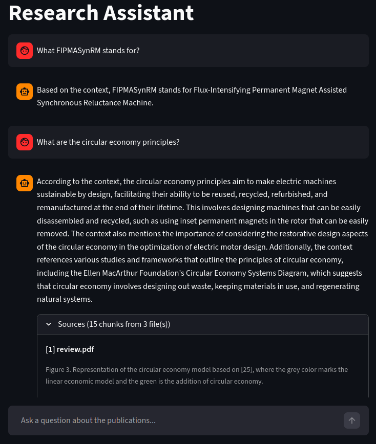

# RAG Research Assistant

A **Retrieval-Augmented Generation (RAG)** application built on the **Databricks Data Intelligence Platform** that lets me query my own academic publications in natural language.

I built this tool to solve a real problem: after years of research I had accumulated hundreds of pages across dozens of papers, and recalling specific details became impractical. This assistant lets me:

- **Ask** complex technical questions and get grounded, cited answers
- **Locate** exact source material with file paths and verbatim context chunks
- **Validate** memory without re-reading entire papers

---

## Architecture

The pipeline follows the **Medallion Architecture**, transforming raw PDFs into a queryable knowledge base entirely within Databricks — no external databases or local inference.

```
publications/*.pdf  (Unity Catalog Volume)
        │
        ▼  ai_parse_document()
    parsed_papers          ← Bronze: structured Variant JSON per PDF
        │
        ▼  PySpark explode + filter
    chunked_papers         ← Silver: one row per chunk, CDF-enabled Delta table
        │
        ▼  Mosaic AI Vector Search  (databricks-gte-large-en, 1024-dim)
    publication_index      ← Hybrid search index (semantic + keyword)
        │
        ▼  Llama 3.3 70B Instruct  (Databricks Model Serving)
    research_assistant     ← MLflow pyfunc model, registered in Unity Catalog
        │
        ▼  REST endpoint
    Streamlit app          ← Chat UI with cited sources
```

### Tech stack

| Layer | Technology |
|---|---|
| Compute & Storage | Databricks + Unity Catalog |
| PDF Parsing | `ai_parse_document` (Databricks AI Functions) |
| Chunking | PySpark structured streaming + CDF |
| Embeddings | `databricks-gte-large-en` (1024 dimensions) |
| Vector Search | Mosaic AI Vector Search — hybrid (semantic + keyword) |
| LLM | Llama 3.3 70B Instruct via Databricks Model Serving |
| Model Registry | MLflow + Unity Catalog (`models-from-code`) |
| Evaluation | `mlflow.genai.evaluate` — Correctness + RelevanceToQuery |
| Orchestration | Databricks Jobs (nightly, Quartz cron) |
| UI | Streamlit |

---

## Pipeline details

### 1. Ingestion & Parsing (Bronze)

PDFs are stored in a Unity Catalog Volume and parsed using `ai_parse_document`, which extracts structured text, layout, and metadata into a Variant-typed Delta table. A PySpark streaming job processes only new or changed files via checkpoint directories.

### 2. Chunking (Silver)

A second streaming job explodes each parsed document into individual chunks using `variant_explode`. Chunks shorter than 150 characters are filtered out. Change Data Feed (CDF) is enabled on the output table so the Vector Search index can sync incrementally.

### 3. Vector Indexing

Mosaic AI Vector Search auto-embeds `chunk_text_string` using `databricks-gte-large-en` (1024 dimensions). The index uses **triggered sync** with CDF, so only new/updated chunks are re-embedded on each run.

**Retrieval strategy: hybrid search** — combining dense vector similarity with BM25 keyword matching. This is critical for technical vocabulary (acronyms like "PMSM", "NdFeB") that pure semantic search can miss.

### 4. Generation

Llama 3.3 70B Instruct receives a context window built from the top-15 retrieved chunks. The prompt uses:
- **Chain-of-Thought (CoT)** reasoning to ground answers in the provided context
- **Few-Shot examples** to model the expected response style
- An explicit instruction to say "I don't have enough information" when the context doesn't support an answer — reducing hallucination

### 5. Model Serving

The RAG chain is packaged as an MLflow `PythonModel` using the **models-from-code** approach and registered in Unity Catalog. A Databricks Model Serving endpoint exposes it as a REST API with AI Gateway usage tracking enabled.

### 6. Evaluation

A synthetic truth table of 20 question/answer/ground-truth pairs is generated from the source documents using `databricks-agents`. Each pipeline run evaluates the RAG system against this table using:
- **Correctness** — factual accuracy relative to ground truth
- **RelevanceToQuery** — whether retrieved context actually answers the question

Results are logged to an MLflow experiment for tracking over time.

---

## Nightly job

All pipeline stages run as a scheduled Databricks job (`rag_nightly_update`, daily at 01:00 UTC) with a 3-hour timeout. The task DAG is:

```
parse_publications
        │
chunk_publications
       ├────────────────────────────┐
create_vector_index    generate_truth_table
       └────────────────────────────┘
                   │
             evaluate_rag
```

`create_vector_index` and `generate_truth_table` run in parallel after chunking completes.

---

## Streamlit UI

The chat interface sends the full conversation history to the serving endpoint on each turn, enabling multi-turn dialogue. Each response includes a collapsible **Sources** panel showing the retrieved chunks and their source file paths.



---

## Repository structure

```
.
├── .env                             # Local configuration
├── job.yml                          # Job definition (schedule, tasks, parameters)
├── deploy_job.py                    # Deploys/updates the Databricks job
├── app.py                           # Streamlit chat UI
├── pipeline/
│   ├── parse_publications.py        # Bronze ingestion
│   ├── chunk_publications.py        # Silver chunking
│   ├── create_vector_index.py       # Vector index sync
│   ├── generate_truth_table.py      # Synthetic evaluation dataset
│   ├── evaluate_rag.py              # MLflow evaluation
│   ├── research_assistant.py        # Standalone RAG function
│   ├── research_assistant_model.py  # MLflow PythonModel
│   ├── deploy_serving_endpoint.py   # Model registration + endpoint deployment
│   └── prompts/                     # System prompt, few-shot examples, agent config
```

---

## Setup

See [CLAUDE.md](CLAUDE.md) for the full step-by-step setup guide, including Databricks prerequisites, first-run instructions, and known pitfalls.
